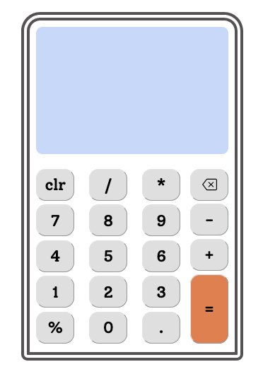

# Project: calculator

## For: The Odin Project

-  This documentation follows the _ReadMe-Template_ from Front End Mentorship

## Table of contents

-  [Overview](#overview)
   -  [The challenge](#the-challenge)
   -  [Screenshot](#screenshot)
   -  [Links](#links)
-  [My process](#my-process)
   -  [Built with](#built-with)
   -  [What I learned](#what-i-learned)
   -  [Useful resources](#useful-resources)

## Overview

### The challenge

[Challenge Description](https://www.theodinproject.com/lessons/foundations-calculator)

### Screenshot



### Links

-  Solution URL: [codes](https://github.com/Bri-elle/calculator_top.git)
-  Live Site URL: [live preview](https://calculator-top-vert.vercel.app)

## My process

### Built with

-  Semantic HTML5 markup
-  CSS custom properties
-  Flexbox

**Note: These are just examples. Delete this note and replace the list above with your own choices**

### What I learned

How to limit decimal points that a user enters

```js
if (currentValue === "." && lastElement.includes(".")) {
	return;
}
```

### Useful resources

ChatGPT

-  I found that using ChatGPT as a tutor, rather than just copying the code, helps me learn more effectively.

W3Schools
-W3Schools makes it easy to understand various concepts

The odin Project

-  Going through class notes and doing all the assignment makes the projects attainable
